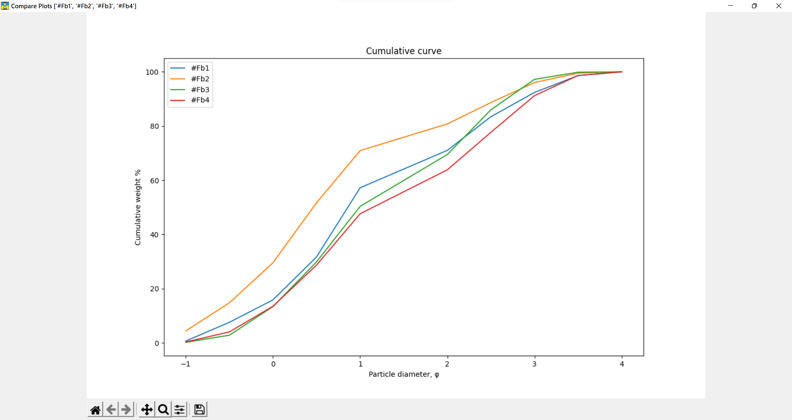

#sand-granulometry
Fast and simple to use application for routine analysis of sand samples

##Requirements
* Python 3.9 or above

##Setup
To setup, create and activate a new python venv and run `pip install -r- reqirements.txt`
Then run main.py using `py main.py`

###How to import my data?

To import your data you should insert in into an Excel workbook. You can just replace rows in Example database.
* First row is for headers. 
* Columns A-H is sample info. Please, don't break the order.
* Columns from I to last is for weights of the fractions, 
from highest to lowest diameter.
Please, use φ units for fractions (mesh diameters) in headers.
You can convert mm or μm to φ using the converter in the Settings tab.
You can use any weight units or percents.

##Interface
###Add sample tab

* Easy way to add new sample to the database during analysis
* Press "Tab" to switch to the next input field
* Press "Check" button to preview the result of computations
* Press "Add Button" to add sample to the database
* You can import data from an Excel workbook

###Compare samples tab

* A tab for a simple comparison of samples
* Left click on the header - sort by chosen column, in ascending or descending order.
* Right click on the header - open filter window.
    * Values list - select any number of values and press "Filter" button. 
Press "Clear all" to clear all filters
    * Index information.
    * From-to - write minimal and maximal values and press "Filter".
* Left click on the row - select one row.
* Ctrl + Left click on the row - select multiple rows.

* "Plot selected samples" button - draw Cumulative curves.
* "Export table as xlsx" button - export filtered table as xlsx.
Cumulative weights and fractions will be also exported.

###Settings
* General settings - rounding and default fractions
* Converter - convert sand diameter
* Add fractions scheme - save mesh size diameter (in φ units) of your sieves 
* in descending order.